# OrthoDJIImage

Developer: Dr. `Haitao Lyu` (`hxl170008@utdallas.edu`)

- GitHub: [lyuhaitao (HAITAO LYU) · GitHub](https://github.com/lyuhaitao)

- LinkedIN: [https://www.linkedin.com/in/lyuhaitao](https://www.linkedin.com/in/lyuhaitao/) 

## Overview

Wild animal surveys conducted using Unmanned Aerial Vehicles (UAVs) equipped with thermal imaging cameras are a powerful tool for conservation and ecological studies. Orthogeoreferencing aligns thermal images with geographic coordinates, allowing for precise mapping of animal locations. This is crucial for spatial analysis and habitat mapping, as it provides accurate data on where animals are located within a landscape, their movement patterns, and their preferred habitats.

| 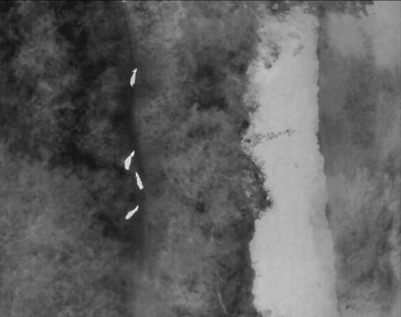 | 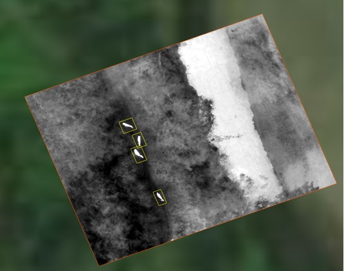 |
| -------------------------------------------------------- | -------------------------------------------------------- |

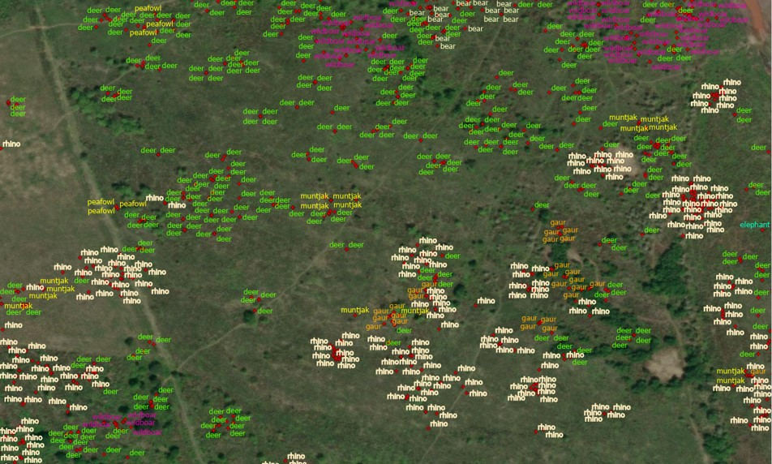

Based on `PyQt6, GDAL, RasterIO, Fiona, Folium, etc`, I developed the GUI application, which can be used to  ortho-georeference thermal images captured by DJI drones.

## Download Application

Click [Download Ortho DJI Image](https://utdallas.box.com/s/m9blbm090njz2qdd57njnyyzkvt0irjz) to download the application.

Download URL: [https://utdallas.box.com/s/m9blbm090njz2qdd57njnyyzkvt0irjz](https://utdallas.box.com/s/m9blbm090njz2qdd57njnyyzkvt0irjz)

It includes a zip file, a .yml file, and a folder.

- OrthoDJIImage.zip

- buffalo. It is a folder that stores the testing thermal images captured by DJI drones.

- enviroment.yml

## Configure Running Environment

- Install `anaconda`

- Open `Anaconda prompt`

- ```conda
  conda env create -f environment.yml
  ```

- After runing the command above, a virtual environment `env_qt` will be created.

- Use the command `conda env list` to show the folder path of `env_qt`. Suppose that the path is `D:\env_qt`

- Add `D:\env_qt\Library\bin` to the system environment variable `Path`.

## Unzip OthoDJIImage.zip

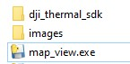

# Getting Started

- Double click `map_view.exe`to launch the application.

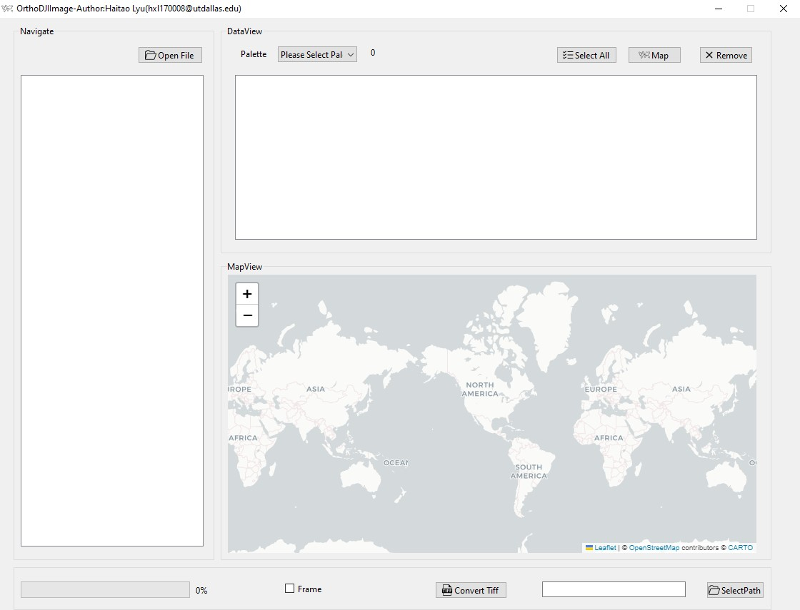

- Click `OpenFile` button to navigate the folder where images are stored. Double click the folder icon, then `DataView` widget will list the detailed information of each image extracted from image meta data. 

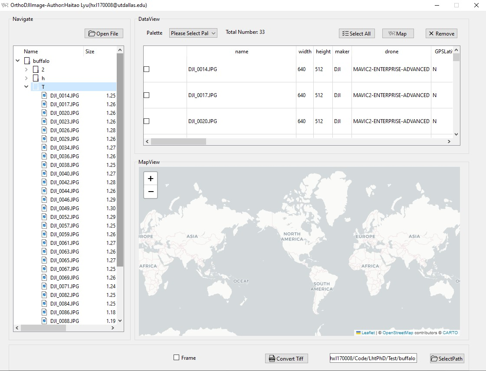

- in `DataView`, double click an item, and a new window will pop out to show the details of the corresponding image.

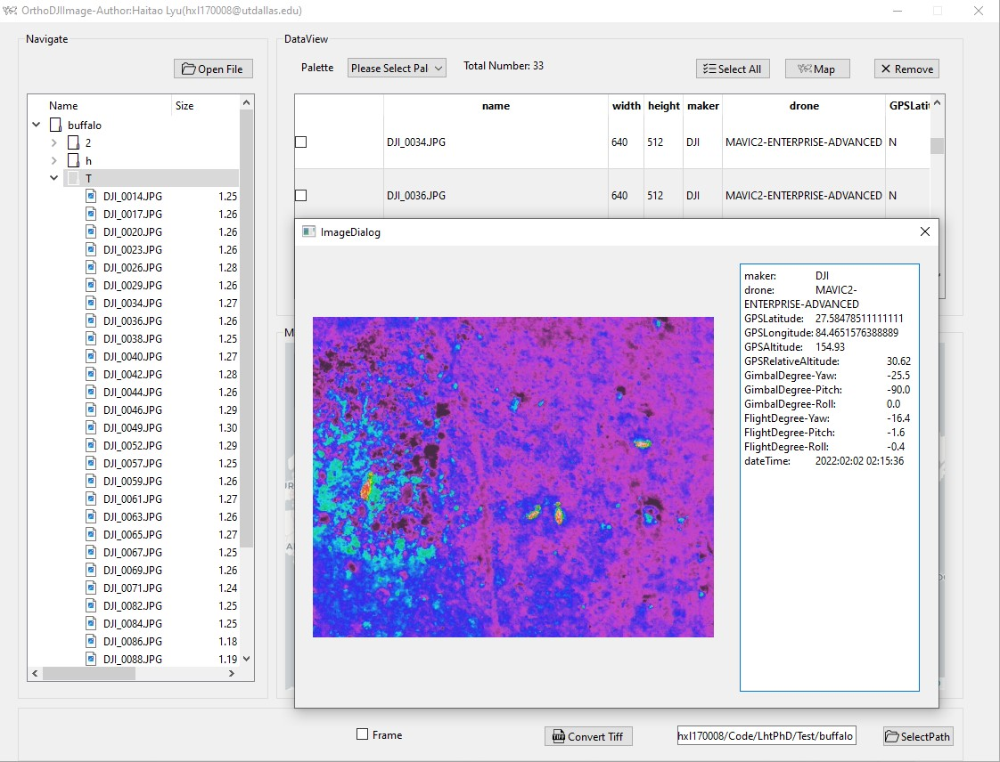

- in the `DataView` widget, clicking the checkbox means that an item is selected. Click the button `Select All` to select all items. 

- Click the button `Remove`, and only the selected items are removed.

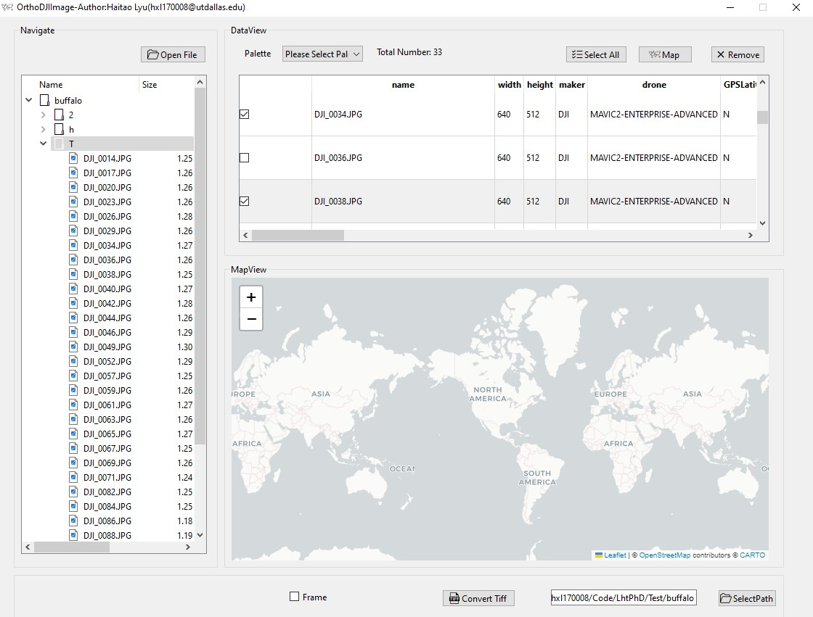

- Click the button `Map` . The locations where images were captured by drones will be mapped on the map in the `MapView`. 

- Locations are denoted as green icons. The arrow in a green icon represents the rotation angel of an image.

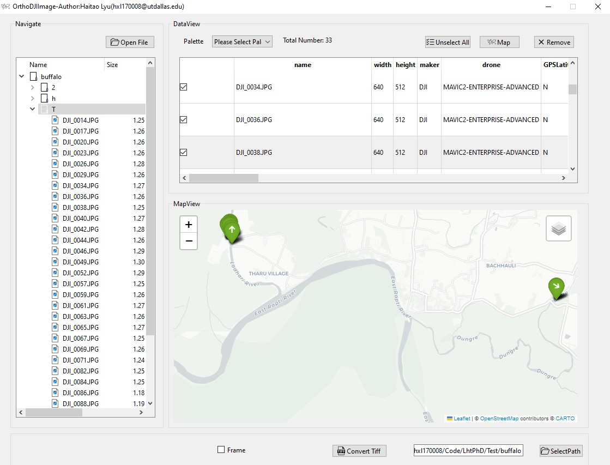

- Click the `Layers Icon` 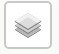to pop out a new window, showing all layers. Each image is represented as a layer. 

- by selecting the checkboxes, you can decide which images will be finally chosen to stay on the map.

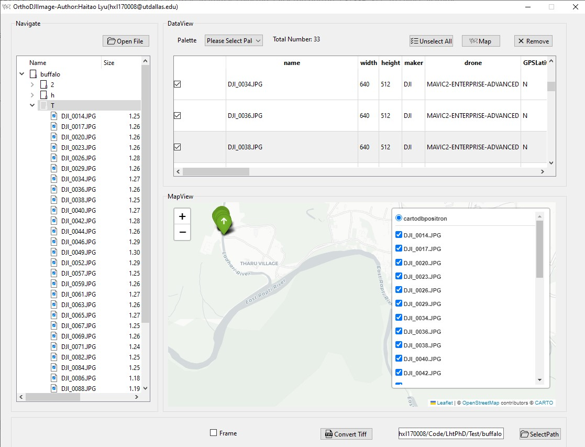

- Select the checkbox 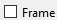 at the bottom, and then click the button `Map`. The frames of images will be mapped on the map.

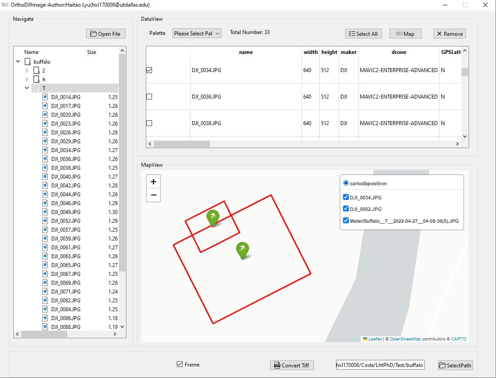

- Click the `green icon`. A `iframe` will be pop out to show the detailed information about the image at this location.

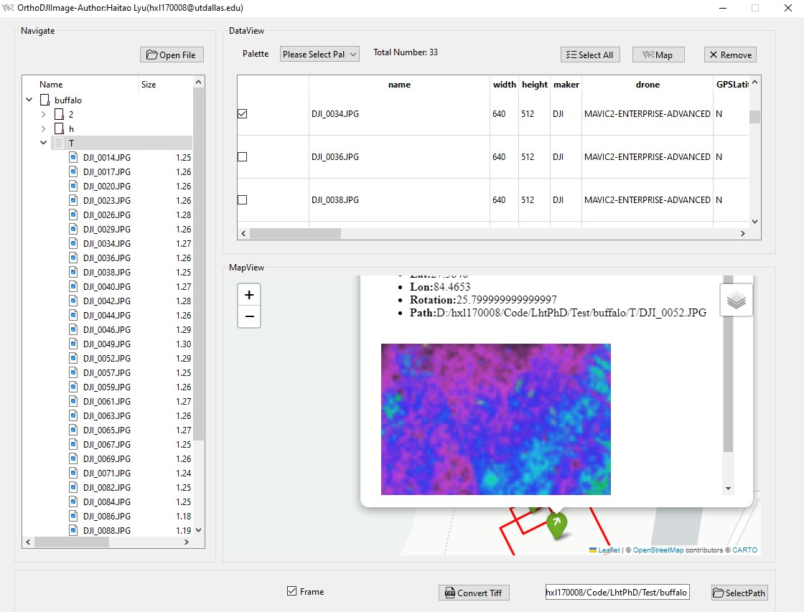

- Click the button 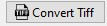. All the chosen images will be ortho-georeferenced, and saved as the `tif` files. 

- The locations and frames are written in a `ESRI shp` file.

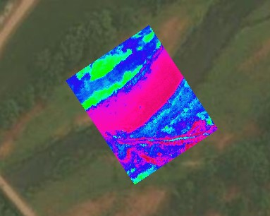

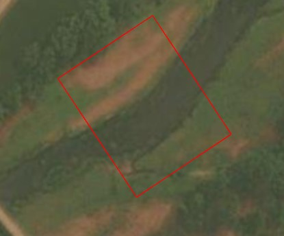
